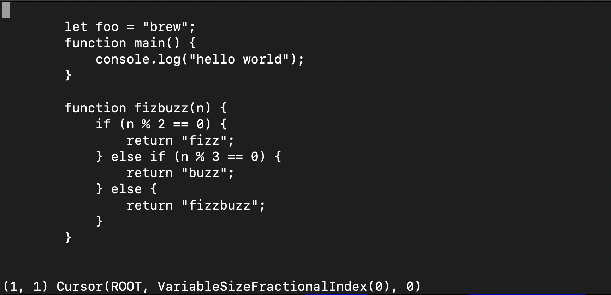

# Rust Token Editor

For a few years, I've had this kinda crazy idea to build my own code editor that addresses some of
the frustrations I have encountered with my current editor (neovim with some plugins). This is one
of a few attempts I've made over the years to do this.

## Rationale

Most editors store text as raw characters in ordered, fixed-size chunks in memory, which makes
character manipulation relatively straightforward, but makes more in depth editor features that
require AST parsing more difficult. To accomplish these, a language server maintains a parallel copy
of the AST in memory which is has to keep in sync with raw text as it is edited.

Maintaining these two copies is a relatively challenging problem to solve well, and therefore,
language servers often get into weird states where they are no longer picking up changes and require
constant restarting.

To me, this could all be solved if there was one representation that could be used for both
operations - one, single AST representation that could be edited directly by a user. This of course
has its own challenges, but I think if executed well could result in a better / more refined final
product than the current state of things.

## Getting Started
Looking at the code, this may be obvious - but this is a bit of a construction zone at the moment.
Most of the core, underlying primitives for AST parsing and text manipulation do actually work (see
`src/node_tree`) and I'm now in the midst of implementing my own vim bindings layer to perform these
operations.

Given this caveat, if you want to give it a shot, you'll need a working rust toolchain (as of the
writing of this document, I'm using 1.78.0). Then, to start the editor in interactive mode, run:
```bash
$ make interactive
```



This will start an editor that will be populated with some example javascript code, which you should
be able to move around with vim bindings like `w`, `W`, `b`, `hjkl`, etc
